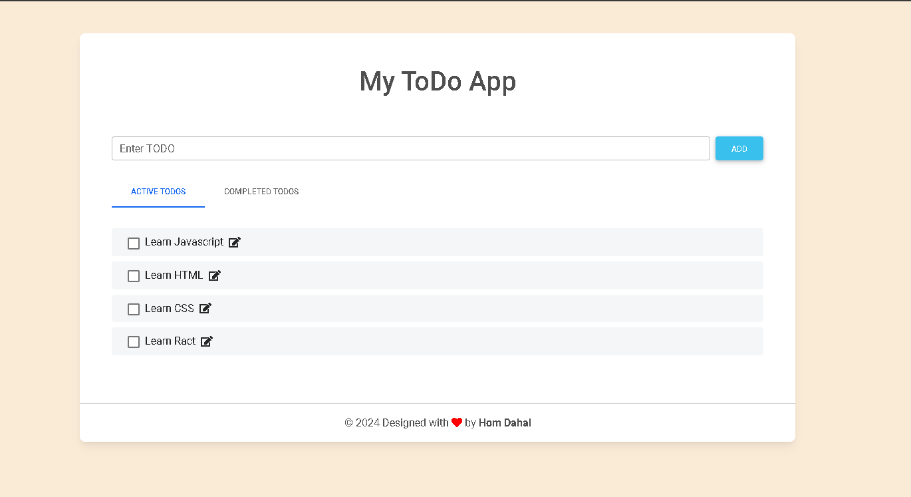
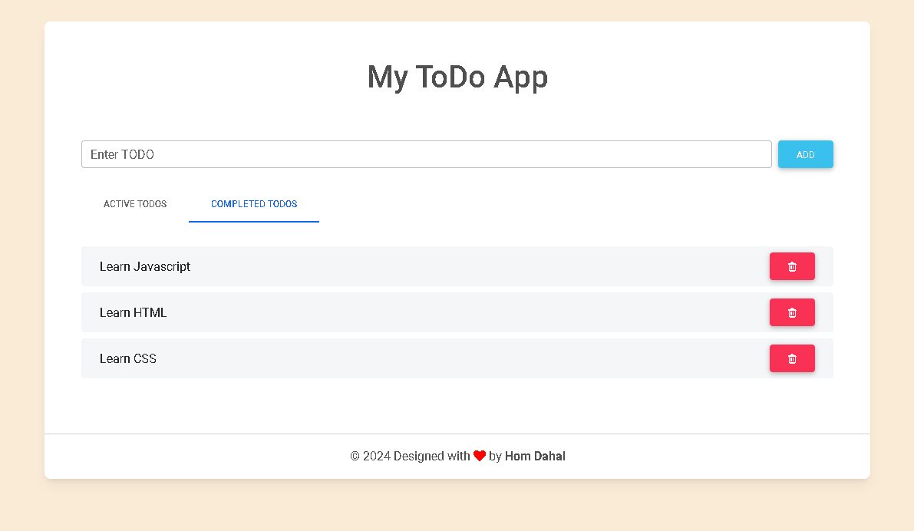

# My TODO App

This is a simple TODO application based on DOM manipulation in JavaScript.

## Features

- Add new todos
- Edit existing todos
- Mark todos as completed
- Delete completed todos

## How it works

The application uses an array to store todos. When the user enters a new todo in the input field and presses the Enter key, the new todo is added to the array.

Each todo is displayed as a list item in the todo list. The list item includes a checkbox to mark the todo as completed, a span to display the todo text, and an edit icon to edit the todo.

When a todo is marked as completed, it is removed from the todo list and added to the completed todos list. The completed todo list item includes a delete icon to remove the completed todo.

## Code Overview

The JavaScript code includes several functions to handle different actions:

- `addTodo()`: Adds a new todo to the todos array and updates the todo list.
- `viewTodos()`: Updates the todo list to display the current todos in the todos array.
- `updateTodo(i)`: Prompts the user to edit the todo at the given index in the todos array and updates the todo list.
- `completedTodo(i)`: Marks the todo at the given index in the todos array as completed, removes it from the todo list, adds it to the completed todos list, and updates the todo list.

## Preview

Here are some previews of the application:

## How to use

To use the application, simply enter a new todo in the input field and press Enter. You can edit a todo by clicking on the edit icon, mark a todo as completed by clicking on the checkbox, and delete a completed todo by clicking on the delete icon.

## Disclaimer

This project uses the Material Design for Bootstrap library and the Font Awesome library for its UI components. The todo list template is based on "Todo list template 4" from Material Design for Bootstrap.
